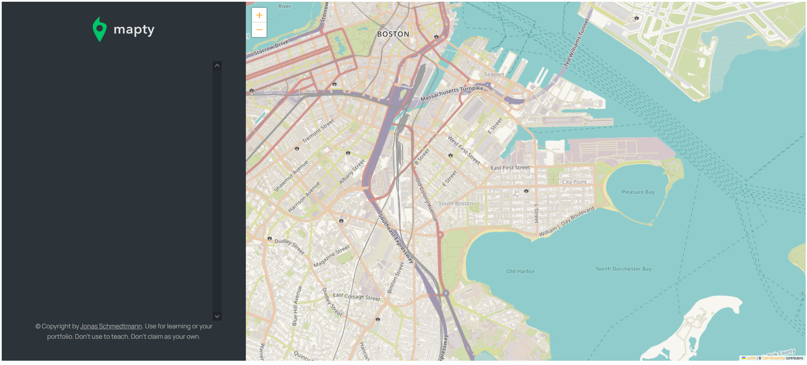
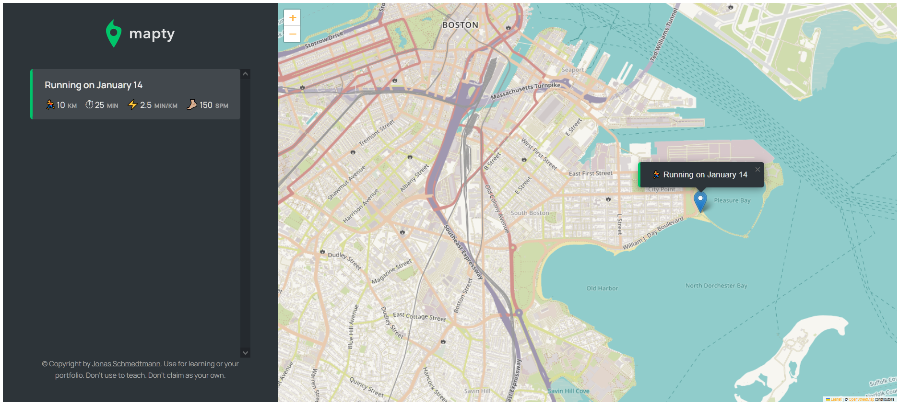
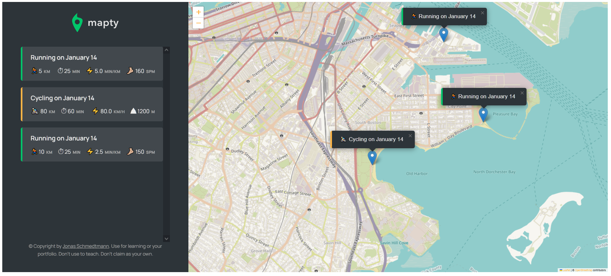

# Workout Tracker using the Geolocation API

[Experiment with the live version.](https://waters1993.github.io/javascript-GeolocationAPI/) See your current location and add some workouts!

## Motivation & Acknowledgements

This project was created while completing "The Complete JavaScript Course 2021: From Zero to Expert!" by Jonas Schmedtmann.

## Work Vs. Template Code

HTML elements and CSS styling were provided as a template file. 
I utilized the external JavaScript library Leaflet to render a map to the client window. 
This was combined with the GeolocationAPI to display the map at the users current location.  The application can then store workouts at locations selected on the map. Workouts are stored in local storage so the state is maintained after closing out the appication.  
The design architechture used for this project was object oriented design with Classes. The Application Class contains all of the methods to get the users current location and render the map and handle user clicks. Each workout class, Running or Cycling, inherits properties from a parent Workout Class. Data for each workout is stored within objects created from these Classes.

## JavaScript concepts and techniques used

- Object oriented programming and design approach (Creating Classes)
- Geolocation API
- Leaflet external JavaScript library
- Local storage
- Agile project planning (user stories, iteration etc.)

## Site images

  
Landing Page

  
   
Running workout added

  
 
Multiple workouts

  

## Built With

- HTML
- CSS
- JavaScript
- GeolocationAPI, Leaflet library
- VS Code
- Git

## Author

- **James Waters**
  [james-waters](https://www.james-waters.com/)
